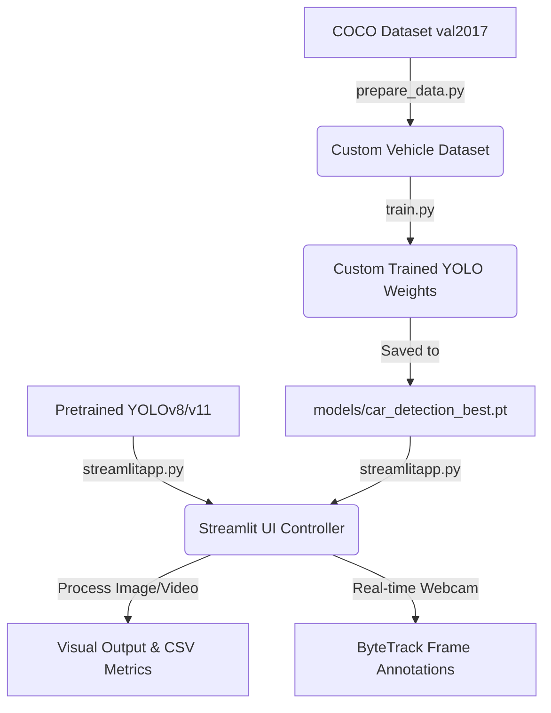

# 🚗 Car Detection YOLO

A high-performance, production-ready vehicle detection, tracking, and evaluation system built on top of **Ultralytics YOLOv8 and YOLO11**. Features a dynamic Streamlit web application, robust dataset preparation pipeline, benchmarking suite, and FastAPI REST service.

```
   ┌─────────────────────────────────────────────────────────────┐
   │                       Car Detection                         │
   │   [Car] 0.98        [Motorcycle] 0.91        [Truck] 0.88   │
   └─────────────────────────────────────────────────────────────┘
```

---

## 🌟 Key Features

*   **Dynamic Streamlit Web App**:
    *   Supports single/batch image processing, video analysis, and real-time webcam feeds.
    *   **Auto-Discover Custom Models**: Scans `models/` directory dynamically to populate the selection interface.
    *   **Dynamic Class Filtering**: Dynamically maps classes based on the loaded model (supports both pretrained 80-class COCO models and custom 4-class vehicle models).
    *   Supports Test-Time Augmentation (TTA), CLAHE contrast adjustment, and ByteTrack object tracking.
*   **Corrected COCO Dataset Pipeline**:
    *   Auto-downloads, extracts, and filters vehicle subsets (`car`, `motorcycle`, `bus`, `truck`) from COCO.
    *   Utilizes a corrected class re-mapper mapping raw annotations (`3` $\rightarrow$ `0` (car), `4` $\rightarrow$ `1` (motorcycle), `6` $\rightarrow$ `2` (bus), `8` $\rightarrow$ `3` (truck)).
    *   Aggregates images containing any vehicle class (union query) for a robust training dataset.
*   **Model Benchmarking Suite**:
    *   Evaluates and compares model configurations across mAP50, mAP50-95, Precision, and Recall.
    *   Auto-adjusts validation datasets to prevent class shape crashes during cross-model testing.
*   **FastAPI REST Service**:
    *   Exposes `/detect` (raw coordinates JSON) and `/detect-annotated` (renders bounding boxes directly) endpoints.
*   **Robust ONNX Exporter**:
    *   Exports trained weights to ONNX format with float32/float16 precision flags, optimized for CPU inference compatibility.

---

## 📐 Architecture & Workflow



---

## 🚀 Quick Start Setup

### 1. Clone & Set Up the Environment
```bash
# Clone the repository
git clone https://github.com/YashSingh0401/Car-Detection-YOLO.git
cd Car-Detection-YOLO

# Create virtual environment
python -m venv venv

# Activate virtual environment
# On Windows:
.\venv\Scripts\activate
# On Linux/macOS:
source venv/bin/activate

# Install dependencies
pip install -r requirements.txt
```

### 2. Prepare the Vehicle Dataset
This script downloads the COCO dataset subset, extracts it, and configures the `data/car_dataset` directory:
```bash
.\venv\Scripts\python.exe run.py prepare
```

### 3. Run the Streamlit Application
Launches the interactive local dashboard:
```bash
.\venv\Scripts\python.exe run.py app
```
*Open http://localhost:8501 inside your web browser.*

---

## 💻 CLI Command Orchestrator

The project includes an orchestrator (`run.py`) to manage training and evaluation tasks:

| Command | Action |
| :--- | :--- |
| `python run.py prepare` | Prepares the quick subset (COCO val2017, ~5k images) |
| `python run.py prepare-full` | Downloads & prepares full COCO training dataset (~118k images, ~18GB) |
| `python run.py train` | Fine-tunes a balanced preset model (`yolo11m.pt`) |
| `python run.py train-gpu` | Trains on GPU with optimized batch sizes and resolution |
| `python run.py train-large` | Fine-tunes high-accuracy YOLO11x models |
| `python run.py evaluate` | Benchmarks and validates model weights |
| `python run.py app` | Launches the Streamlit Application |
| `python run.py all` | Runs full sequence (prepare $\rightarrow$ train $\rightarrow$ evaluate) |

---

## 🛠️ Custom Training Configuration

Training presets and hyperparameters are configured inside `train.py` using the `TrainingConfig` dataclass:

```python
from train import TrainingConfig, train_model

# Initialize custom training configuration
cfg = TrainingConfig(
    model_name="yolo11m.pt",  # Base model
    epochs=150,               # Number of epochs
    batch=16,                 # Batch size
    imgsz=640,                # Image resolution
    device="cuda",            # CUDA GPU or CPU
    optimizer="AdamW",        # Optimizer algorithm
    lr0=0.001,                # Initial learning rate
)

# Run fine-tuning
train_model(cfg)
```
*Best weights are automatically saved to `models/car_detection_best.pt` once training finishes.*

---

## 📂 Project Structure

```
├── streamlitapp.py          # Streamlit UI (Image/Video/Webcam, Tracking, Augmentation)
├── train.py                 # Training Pipeline wrapper & Hyperparameter configs
├── prepare_data.py          # COCO vehicle class filter, re-mapper & downloader
├── evaluate.py              # Performance benchmark comparisons
├── api.py                   # FastAPI service (/detect, /detect-annotated)
├── export_onnx.py           # ONNX CPU/GPU exporting script
├── run.py                   # Central pipeline CLI orchestrator
├── requirements.txt         # Pinned python dependencies
├── runtime.txt              # Deployment environment definition
├── packages.txt             # Deployment OS packages (ffmpeg)
├── tests/                   # Automated unit testing suite
├── models/                  # Storage directory for custom weights (*.pt)
└── data/                    # Storage directory for COCO / Custom datasets
```

---

## 🚀 API Deployment

To run the FastAPI web server locally:
```bash
.\venv\Scripts\python.exe api.py
```
*The REST API will be hosted on http://localhost:8000.*

### Endpoint: `/detect`
Send a `POST` request with an image file. Returns bounding boxes, confidences, and dynamic class names in JSON format:
```bash
curl -X POST -F "file=@car.jpg" http://localhost:8000/detect
```

---

## 🤖 Technology Stack

*   **Core Detector**: [Ultralytics YOLOv8 / YOLO11](https://github.com/ultralytics/ultralytics)
*   **Web Dashboard**: Streamlit
*   **Processing & Tracking**: OpenCV, ByteTrack
*   **Data Aggregation**: pycocotools
*   **Model Exporting**: ONNX Runtime
*   **Backend Hosting**: FastAPI, Uvicorn

---

## 👤 Author

*   **Yashwardhan Singh Sengar** — *Creator & Maintainer*
